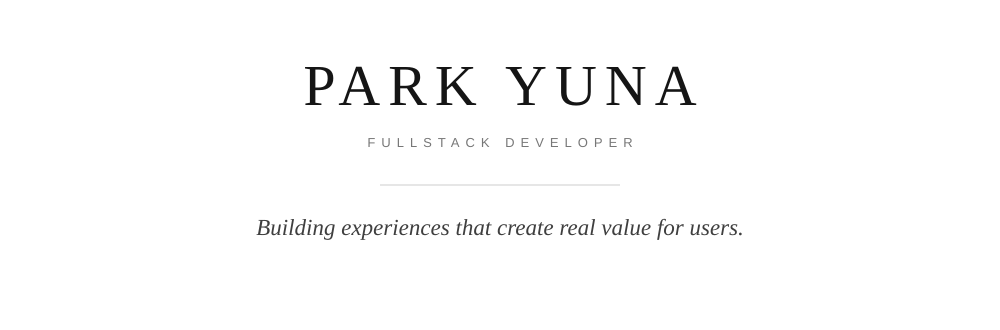

  

 

## About

사용자의 관점에서 문제를 바라보고,  
기술을 통해 **더 나은 경험과 실질적인 가치**로 연결하는 과정에 관심이 있습니다.

프론트엔드와 백엔드를 함께 경험하며  
서비스의 전체 흐름을 이해하는 개발자로 성장하고 있습니다.

 

---

 

## Tech Stack

### Main

  
  
  
  

### Experienced

  
  
  
  
  
  

### Tools

  
  

 

---

 

## Selected Work

### 01 / DNDN Life

**AI Financial Companion for Seniors**  
*KB Hackathon · Team Leader / Frontend*

시니어의 금융 서비스 이용 과정에서 발생하는  
복잡한 선택과 금융사기 위험을 줄이기 위해 기획한 서비스입니다.

음성 금융 비서, Context 기반 이상거래 탐지,  
시니어 친화적인 인터페이스를 통해  
보다 쉽고 안전한 금융 경험을 설계했습니다.

**Role**

`Team Leading` · `Frontend Development` · `UX/UI` · `Service Planning`

**Tech**

`React Native` · `Expo` · `REST API` · `AI`

 

### 02 / Youngly

**Financial Habit Building Service for Young Adults**  
*KB IT's Your Life · Final Project*

자기계발에는 적극적이지만 장기적인 자산 관리는 미루기 쉬운  
20대의 행동 특성에서 출발한 금융 서비스입니다.

운동과 학습 같은 일상 활동을 저축과 연결해  
금융 행동을 자연스럽게 습관화할 수 있도록 설계했습니다.

프론트엔드와 백엔드를 함께 경험하며  
서비스의 전체 흐름을 구현했습니다.

**Tech**

`Vue.js` · `Spring Legacy` · `MySQL` · `JavaScript`

 

---

 

## Experience

### MyDataLab
**R&D Intern**

`Python` · `Flask` · `MySQL` · `OpenAI API`

기업 공시 데이터를 활용해  
경쟁사, 핵심 사업, 위험 요인 등을 조회할 수 있는  
AI Q&A 기능과 백엔드 서비스를 개발했습니다.

 

### KB IT's Your Life
**Fullstack Development Program · 6 Months**

`Vue.js` · `Spring Legacy` · `MySQL`

금융 IT 서비스 개발에 필요한  
프론트엔드와 백엔드 기술을 학습하고,  
팀 프로젝트를 통해 서비스 개발 전 과정을 경험했습니다.

 

### KB Hackathon
**Final Round · Team Leader**

시니어 금융 서비스의 기획과 사용자 흐름 설계,  
프론트엔드 개발을 담당했습니다.

 

---

 

## Education

**Hanyang University ERICA**  
Computer Science

 
